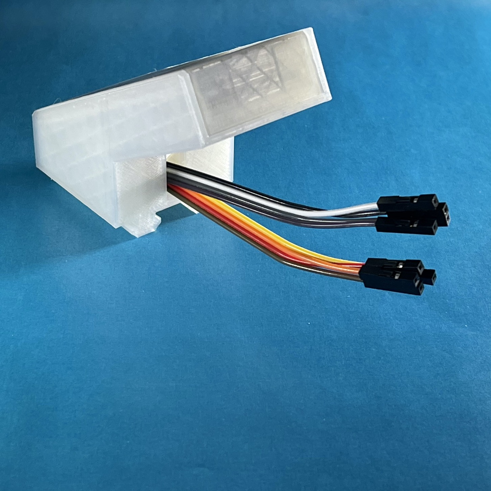

# OctoPrint Micro Panel (formerly Display Panel)


This plugin implements the software control side of an OctoPrint Control Panel for Octopi. The hardware half is a series of 4 buttons, an OLED screen and a 3D printed case that mounts on the printer next to the Raspnerry Pi so it can be plugged in to the header pins.

**Watch a demo of the panel in action!** More photos are at the end of this readme.

[](https://youtu.be/78emT1ollu4 "Click here to watch a demo on YouTube")

## Resources

Check out our [Community Discussions](https://github.com/sethvoltz/OctoPrint-DisplayPanel/discussions) forum for build show and tell, discussing new features and community support!

## Hardware

Besides the [3D printed parts](https://www.thingiverse.com/thing:4674214), you will need the following parts:

- 1x 30x70mm proto board ([Amazon](https://www.amazon.com/gp/product/B06XGWSWT1))
- 1x 0.96" i2c OLED display ([Amazon](https://www.amazon.com/gp/product/B0833PF7ML))
- 4x 12mm tactile buttons ([Amazon](https://www.amazon.com/gp/product/B019I11FI2))
- Wires

Wire up the board as in the diagram below, ensuring that the OLED is set at or below the height of the buttons. The buttons will not fit through the proto board holes, instead they will just fit in and sit above the board. This is expected and the 3D model accounts for it.

Once the board is wired up, run the wires through the hole in the back of the base of the case, slide the board into the lid and slide the lid into the base. Depending on your printer, the lid should slide on with just enough grip to hold in place and the lid and base work together to hold the board in the correct position.


## Setup

**NOTE:** This plugin required OctoPrint to be updated to run on Python 3. Please follow [these instructions](https://community.octoprint.org/t/upgrade-your-octoprint-install-to-python-3/23973) if you are not already on Python 3.

First ensure i2c is enabled on the Pi by running `sudo raspi-config` and navigating to `Interfacing Options` > `I2C` > `<Yes>` > `<OK>`. Exit the config tool, then restart the Pi.

After restarting, install `i2c-tools` and make sure the Pi can see the display.

```bash
$ sudo apt-get update && sudo apt-get install i2c-tools
...
$ sudo i2cdetect -y 1
     0  1  2  3  4  5  6  7  8  9  a  b  c  d  e  f
00:          -- -- -- -- -- -- -- -- -- -- -- -- --
10: -- -- -- -- -- -- -- -- -- -- -- -- -- -- -- --
20: -- -- -- -- -- -- -- -- -- -- -- -- -- -- -- --
30: -- -- -- -- -- -- -- -- -- -- -- -- 3c -- -- --
40: -- -- -- -- -- -- -- -- -- -- -- -- -- -- -- --
50: -- -- -- -- -- -- -- -- -- -- -- -- -- -- -- --
60: -- -- -- -- -- -- -- -- -- -- -- -- -- -- -- --
70: -- -- -- -- -- -- -- --
```

The `3c` there is the OLED display. If you don't see it, check your wiring and try rebooting the pi again.

With I2C confirmed, install via the bundled [Plugin Manager](https://docs.octoprint.org/en/master/bundledplugins/pluginmanager.html) or manually using this URL:

```none
https://github.com/sethvoltz/OctoPrint-DisplayPanel/archive/main.zip
```

## Configuration

There are no configuration options for this plugin at the moment. Plug and play!

## More Photos





## Thanks

**Many thanks** to the amazing community contributors that help support and improve this for everyone!

| [<br /><sub><b>Jörg Eichhorn</b></sub>](https://github.com/unclej84) | [<br /><sub><b>Andy Barnett</b></sub>](https://github.com/Andy-ABTec) |
| :---: | :---: |
